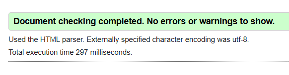
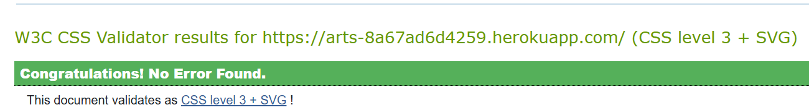
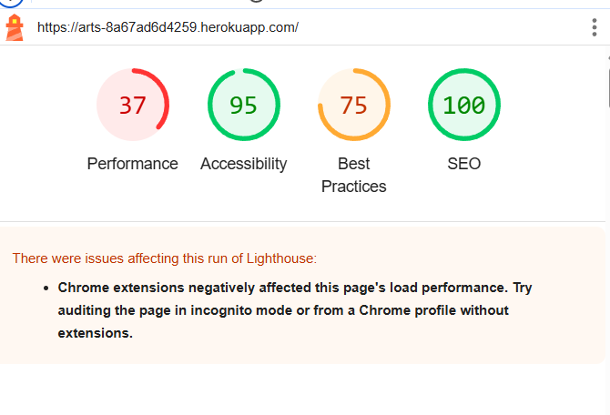
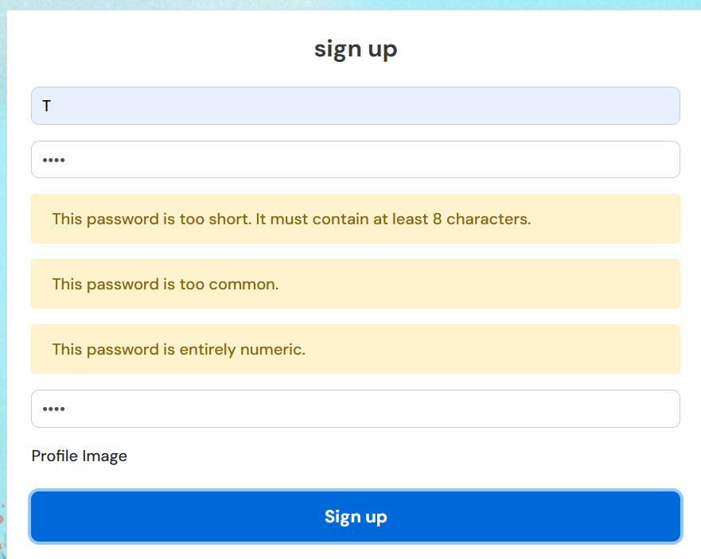
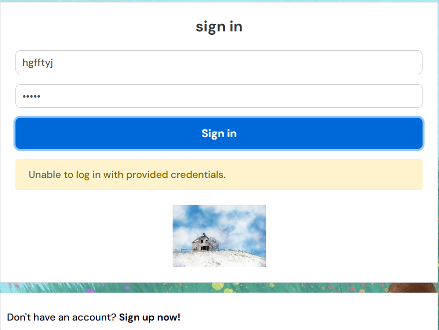
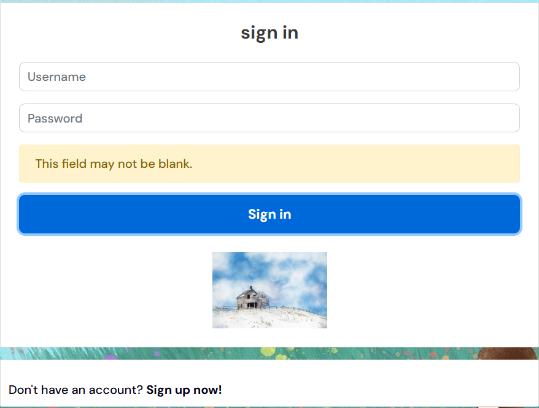

# **Art Connect**
Art Connect is an interactive art blogging platform that allows users to share their artwork, engage with posts through likes and comments, and explore different categories. The inspiration for creating this blog came from my spouse, who is an artist and has always wanted a space to showcase his work and connect with other creatives. 
While this website could have real-world applications, it was specifically developed as part of Portfolio Project 5 (Advanced Front End) for the Diploma in Full Stack Software Development with Code Institute.
 Although it’s not a fully realized blog, the process has given me valuable insights into what I can build for my spouse in the future.
Take a look at the live website [here](https://arts-8a67ad6d4259.herokuapp.com/)

# [Table of Contents](#table-of-contents)
- [**Project**](#project)
  - [Objective](#objective)
  - [Site User's Goal](#site-users-goal)
  - [Site Owner's Goal](#site-owners-goal)
  - [Project Management](#project-management)
- [**User Experience (UX)**](#user-experience-ux)
  - [User Stories](#user-stories)
  - [Site Structure](#site-structure)
  - [Design Choices](#design-choices)
- [**Existing Features**](#existing-features)
  - [Authentication](#authentication)
  - [Homepage](#homepage)
  - [Timeline](#feed)
  - [Liked](#liked)
  - [Profile Page](#profile-page)
- [**Future Implementations**](#future-implementations)
- [**Technologies Used**](#technologies-used)
  - [Languages](#languages)
  - [Frameworks & Software](#frameworks--software)
  - [Libraries](#libraries)
- [Testing](#testing)
- [Deployment](#deployment)
- [Credits](#credits)
- [Acknowledgements](#acknowledgements)

# **Project**

## Objective

The objective of this project is to create a web apllication where artist can come together to showcase their works of art, share ideas and organize art exhibitions.

## Site User's Goal

The goal of the Art Blog site is to create a vibrant online community for artists and art enthusiasts. Users can:

#### 🎨 Share Artwork – Upload and showcase their art through posts with images and descriptions. 
#### ❤️ Engage with Others – Like, comment on, and follow other artists to build a creative network.
#### 📸 Browse Art Galleries – Explore different categories of artwork in an organized gallery view.
#### 🔔 Stay Updated – Follow favorite artists to receive updates on their latest posts.
#### ✍️ Discuss & Collaborate – Engage in meaningful discussions about art, techniques, and inspiration. 
#### 📅 Create & Share Events – Users can post details about upcoming art events, workshops, exhibitions, or meetups.
#### 💬 Discuss & Network – Each event could have a comment section for discussions, collaborations, or carpooling arrangements

[Back to top](<#table-of-contents>)

## Site Owner's Goal

#### 🎨 Fostering an Art Community – Create a welcoming space where artists and art lovers can share, discuss, and appreciate art.
#### 📈 Growing User Engagement – Encourage users to post, comment, like, and interact with each other’s work.
#### 🔗 Networking & Collaboration – Help artists connect for collaborations, commissions, and exhibitions.
#### 📅 Promoting Art Events – Provide a platform for sharing art-related events, workshops, and gallery openings.
#### 💰 Monetization & Sustainability – Explore options like ads, premium memberships, or featured posts to sustain the platform.
#### 🏆 Showcasing Talent – Highlight emerging artists and their work through featured posts or interviews.

[Back to top](<#table-of-contents>)

# **User Experience (UX)**

### ✅ Easy Navigation – Users should be able to browse posts, profiles, and events seamlessly with a clean and intuitive UI.

#### 👤 Personalized Profiles – Users can customize their profiles, showcase their portfolio, and engage with others.

#### 🖼 Smooth Image Upload & Display – High-quality image uploads with a visually appealing view for artwork. User can edit and delete their posts

#### 🔍 Effective Search & Filtering – Users should be able to find specific artworks, artists, or events easily.

#### ❤️ Interactive Features – Likes, comments, and follows to encourage engagement and community-building.

## User Stories
Like with the backend, I used the Kanban project board in GitHub to help guide me through the user stories for the frontend application. creating this API. I used Agile principles again to create 5 EPICs and their subsequent user stories, where each user story belongs to one EPIC. Since most user stories dealing with my 7 separate apps in this project were discussed in the backend README documentation, I'll cover new EPICs here along with their user stories.

### NavBar
As the developer I can create a functional navigation bar at the top of my page so that users can easily look at different pages of the site.

#### User Stories
- As a user I can click each navbar icon so that I am redirected to different pages.
- As a user I can upload a profile picture so that other users can see who my account belongs to.

### Homepage
As the developer I can create a homepage where users can log in / register and see site information so that they know of events occurring.

#### User Stories
- As a user I can create an account so that I can create and view posts and see other users' profiles.
- As a user I can log into my account so that I can interact fully with the website.
- As a logged in user I can see a list of posts so that I can like and share my comments on.
- As a logged in user I can use the search bar so that I can search for posts or other users by keyword.
- As a logged in user I can view the 'popular profiles' section so that I can see profiles of other users and choose to follow them.

### Profile
As the developer I can create a Profile section so that users can update personal information and images.

#### User Stories
- As a user I can upload a picture so that other users can see who I am via my profile.
- As a user I can view others' profiles so that I can see their posts and profile details.
- As a user I can edit my own profile so that the information always remains updated and correct.
- As a user I can change my username and password so that these credentials are updated in case of a security issue.

### Comments
As the developer I can create a Comments section so that users can comment on posts and interact with others on the site

#### User Stories
- As a user I can comment on a post so that others will know my opinion.
- As a user I can view other comments on a post or event to know what their opinion is on the post.
- As a user I can edit my own comments so that information is corrected.
- As a user I can delete my own comments so that any erroneous information from a comment is not on the site.
- As a user I can like and unlike comments of other users.

### Following
As the developer I can create a followers section so that registered, logged in users can follow and unfollow other users.

#### User Stories
- As a user I can follow another registered user so that I can view their profile on my feed page.
- As a user I can unfollow another registered user so that their profile information will no longer be visible on my feed page.
- As the developer I can create follow / unfollow buttons so that registered, logged in users can follow and unfollow other users.

[Back to top](<#table-of-contents>)

## Site Structure

 The Art connect blog is interactive, both for non registered, non logged-in users and for users signed into their account. Depending on login status different pages are available for the user. When the user is logged out the pages: Home, and Sign In or Up are available from the Navigation Bar menu. When the user is logged in, Home, Timeline,Signout and Profile Page also become available.

 # **Existing Features**

* ## Navigation

The navigation bar is straight forward and easy to interact with. Depending on the user's log-in status, different icons for different pages are visible. When navigating from a tablet or mobile device, the full navigation bar becomes a hamburger dropdown menu with the site icon to the far left.

For first time users and for those who are logged out of their account, the following menu is visible:

* Art Connect blog name - On the far left hand side of the navigation bar users can see the name of the blog. Clicking the name will return the user to the homepage.
* Homepage - The first menu icon and the landing page of the site is the homepage. Here, the user can see all posts, their descriptions and view any comments. At the top, there is a search field where users can search an activity by keyword or author, while on the right-hand side, there is a section of most followed profiles.
* Authentication - Users can either sign up for an account or sign into their existing one. Clicking either of these icons will take users to the corresponding page.

Once logged in, the user will see additional icons and be able to navigate to those pages. Those include:

* Timeline - Here users can see a list of post made by people they follow. To the right, they have a section of 'most followed profiles' and just under the navigation bar, a search bar is visible where users can search by keyword or by author.
* Liked - This page shows all the posts that the logged-in users has 'liked'. Clicking again on the heart icon will 'unlike' the activity and it will be removed from this page upon refresh. 
* Comment - This is located just under the ppost and logged-in users can comment on a post and their posts can also be liked.
* Authentication - The only icon that appears for logged-in usres is the 'sign out' icon, which will log the user out if clicked and return them to the homepage.
* Profile - This is the user's own profile that will show their avatar image if they uploaded one. If not, a default avatar image will be displayed. Clicking the avatar will bring them to their profile page where they can see all artworks and events they posted and update their profile. Users can change their username or password and edit their profile, updating the avatar image and their bio information.

[Back to top](<#table-of-contents>)

# **Future Implementations**

- Delete Confirmation - Confirming a delete before executing it is an aspect that would be beneficial to this website. At the moment, users can delete posts, comments and reviews with just one click of a button. A tool tip or other pop-up message asking the user if they're sure they want to delete would be a safer way to erase information, helping to guard against accidental deletes and therefore, loss of data.
- Image Galleries – Allow users to create albums or collections of their artworks.
- Image Filters & Editing – Integrate basic photo filters and editing (e.g., cropping, brightness adjustment).
- Video Uploads – Allow users to share time-lapse painting videos or art tutorials.
- Comment Replies & Threads – Allow users to reply to comments in a nested format.
- Tagging & Mentions – Users can tag other artists using @username in posts and comments.
- Notifications – Implement real-time notifications for likes, comments, follows, and event invites.
- Saved Posts – Users can bookmark favorite artworks to a "Saved" section.
-  Virtual Art Exhibitions – Host online art galleries or digital showcases.

[Back to top](<#table-of-contents>)

# **Technologies Used**

## Languages

* [HTML5](https://en.wikipedia.org/wiki/HTML) - Used for content and structure of the website.
* [CSS3](https://en.wikipedia.org/wiki/CSS) - Used for styling of pages.
* [JavaScript](https://en.wikipedia.org/wiki/JavaScript) - Provides interactive elements of the website.
* [React.js](https://en.wikipedia.org/wiki/React_(software)) - Used to develop frontend components.

## Frameworks & Software
* [React Bootstrap](https://react-bootstrap.github.io/) - A CSS framework used to aid the developer in creating responsive, mobile-first websites.
* [GitHub](https://github.com/) - Hosts both the frontend and backend repositories for this project. Stores commit history and manages project boards for user stories.
* [Heroku](https://en.wikipedia.org/wiki/Heroku) - A cloud platform that houses this deployed application, both frontend and backend.
* [Lighthouse](https://developer.chrome.com/docs/lighthouse/overview/) - Used to test site performance.
* [UI Dev Amiresponsive](https://ui.dev/amiresponsive) - Used to check responsiveness of this application on various device sizes.
* [Favicon](https://favicon.io/) - Used to create the favicon.
* [Google Chrome DevTools](https://developer.chrome.com/docs/devtools/) - Used to test app responsiveness and debug.
* [Cloudinary](https://cloudinary.com/) - Used to host all image files for this application.
* [HTML Validation](https://validator.w3.org/) - Validate HTML code in this project.
* [CSS Validation](https://jigsaw.w3.org/css-validator/) - Validate CSS code in this project.
* [JSHint Validation](https://jshint.com/) - Validate JavaScript code in this project.

## Libraries

* [NPM React-star-rating](https://www.npmjs.com/package/react-simple-star-rating) - Component used to incorporate the star-rating system for the Reviews section of this application.

[Back to top](<#table-of-contents>)

# Frontend Testing

## Table of Contents

* [**Testing**](<#testing>)

## Code Validation
### HTML, CSS and JavaScript validation
HTML validation was done using the [W3C HTML Validator](https://validator.w3.org/). No error was found

HTML Score

Validation score

  

CSS files were validated through the [Jigsaw validator](https://jigsaw.w3.org/css-validator/). all pages passed with no errors.

CSS Score

  

JavaScript files were manually validated and errors resolved throughout the development process through feedback from the gitpod terminal. 

Files were also manually run through [JS Hint](https://jshint.com/). Though no errors were found, a few 'warnings' were present on various pages. These were largely in relation to the version of ES used:

- Unclosed regular expression.
- 'Async functions' is only available in ES8 (use 'esversion: 8').
- 'Object spread property' is only available in ES9 (use 'esversion: 9').
- 'Optional chaining' is only available in ES11 (use 'esversion: 11').

[Back to top](<#table-of-contents>)

### Lighthouse Testing

Lighthouse testing was performed through the Google Chrome Developer Tools was used to test the application's *Performance*, *Accessibility*, *Best Practices* and *SEO* as a logged-in user on a desktop device. 

The performace score was rather poor, this was largely due to the extensions on chrome. This score could be improved in future iterations by compressing the images before uploading them.

Lighthouse Score

  

## Manual Testing
### Sign up
- The sign up page includes a form for registering new users.
- Filling out a valid form (including username and password) posts the data to the API and creates a new user.
- Filling out a valid form redirects the user to the Sign in page.
- Filling out an invalid form notifies the user what changes they need to make, which can be: leaving a field blank, too short or too common a password or passwords not matching.
        
    
        
[Back to top](<#table-of-contents>)

### Sign in
- The page displays a simple form where a previously registered user can log into their account
- Filling out a valid forms will allow the user to access the website, where they will be redirected to the homepage.
- Filling out an invalid form alerts the user of the changes they need to make:
    - Credentials don't match
    
    - Field(s) left blank
    
- The form is fully responsive on various screen sizes and includes an image on larger sizes. On smaller devices, the image disappears.
- A link at the bottom allows users to be redirected to the sign up page if they don't have an existing account.

[Back to top](<#table-of-contents>)

### Navigation Bar
### Non-registered and non logged-in users
- The navbar is shown with links to the homepage, sign up and sign in pages.
- All three links redirect the user to the appropriate page, while clicking the site logo redirects them to the homepage.
- The navbar is responsive and collapses into a hamburger dropdown menu on smaller device screens.

### Registered and logged-in users
- When the user is logged into their account, the navigation bar includes the pages: 'Create a Post', 'Timeline', 'Liked', 'Sign out' and 'Profile'. 
- The profile page includes the user's avatar image (or a default image). Clicking the avatar image will redirect the user to their profile page.
- All links in the navigation have been tested and properly redirect the user to the appropriate page. 
- The navbar is responsive and collapses into a hamburger dropdown menu on smaller device screens.

## Homepage 
## Create a Post
- By clicking the 'Create post' icon next to the site name, the user can access the form to create a post. This link is present in the navbar on all pages. On smaller device screens it appears alone between the site icon and the hamburger dropdown menu.
- The form features three fields: a mandatory title, an optional description and a mandatory image upload. Not filling out one of the mandatory fields will alert the user or an error and ask them to rectify it. 
- Once an image has been loaded, a 'change the image' button will appear, allowing the user to click and select a different image to display.
- Once the 'create' button is clicked, the form is submitted, the data is saved to the backend API and the event appears on the frontend website.
- Clicking the cancel button will send no information to the backend API and the user will be redirected to page they were previously on.

[Back to top](<#table-of-contents>)

# **Deployment**

### Deployment to Heroku
1. Log into your heroku account, select Create New App, and name it something unique to this project.
2. Select the region corresponding to where you are and click 'Create App'.
3. Click the 'Deploy' tab and select GitHub as the 'deployment method'.
4. Search for your project repository and click 'Connect'.
4. Click 'Deploy Branch' for Heroku to start the build process.
5. If the build is successful, you'll see the 'build succeeded' message. Click 'Open App' to view your live Heroku application in the browser.

### Connect the React Frontend to the backend API

After the workspace is set up and the Heroku deployment successful, you can connect the workspace to the backend API.

1. Go to the API application settings from the Heroku dashboard.
2. In the 'Settings' tab, click on 'Reveal Config Vars' and add 'CLIENT_ORIGIN'. Set that to the URL for the deployed React frontend application.
3. Add an additional Config Var, 'CLIENT_ORIGIN_DEV', and paste in the URL of your local gitpod workspace, making sure to exclue the '/' at the end of the URL.
4. Go back to your frontend gitpod workspace and install the Axios library using the command 'npm install axios'.
5. Create a folder called 'API' and within that, a file called 'axiosDefaults'.
6. Import axios at the top of the file.
7. Define the baseURL, which is the URL from the deployed Heroku backend API project.
8. Set the content-type header to multi-part/form-data since the API will have to deal with both images and text in the requests.
9. To avoid any CORS issues, set withCredentials to True.
10. Import this file into App.js to be used throughout the application.

### Fork this Project Repository

For others to be able to work independently furthering this project, they can fork the GitHub repository from the GitHub account. The copy can then be viewed and worked on without changing the original. To fork the repository, log into GitHub and locate the repository, At the top right of the page, you'll see a 'Fork' button. Click that button to create a fork of the original repository. 

### Clone this Project Repository
Another option is to clone the repository, which will link the copy to the original and syncronize the updates. To do this, click the 'Code' button within the selected repository and then choose 'Clone' from the dropdown menu.

[Back to top](<#table-of-contents>)

# **Credits**

*[Pixabay](https://pixabay.com/) -  Some images were obtained through a pixabay and are only used for the purpose of this project. while the other artworks were done by my husband .

* Some of the codes used were from the walkthrough video of the moment app made by Code institute

