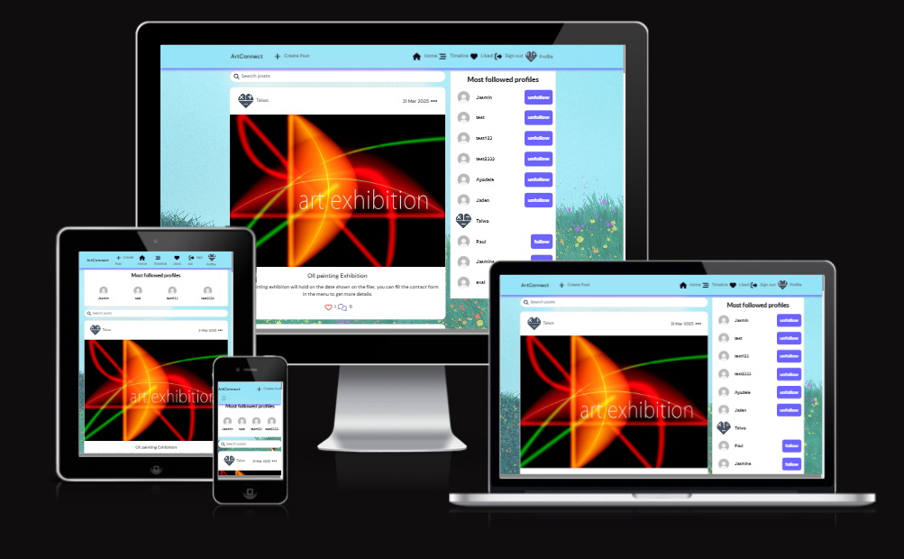
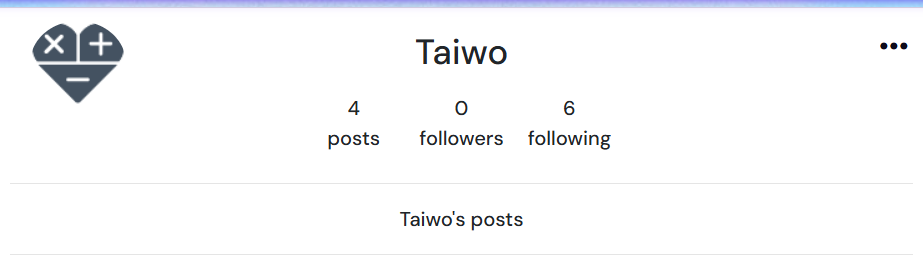
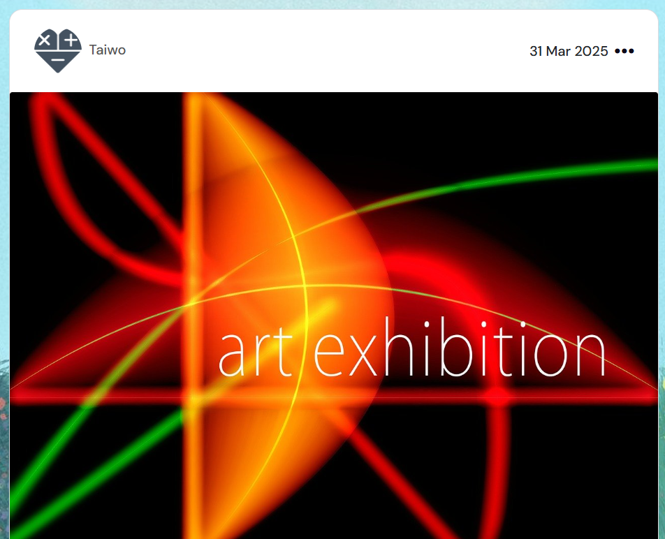
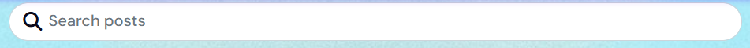
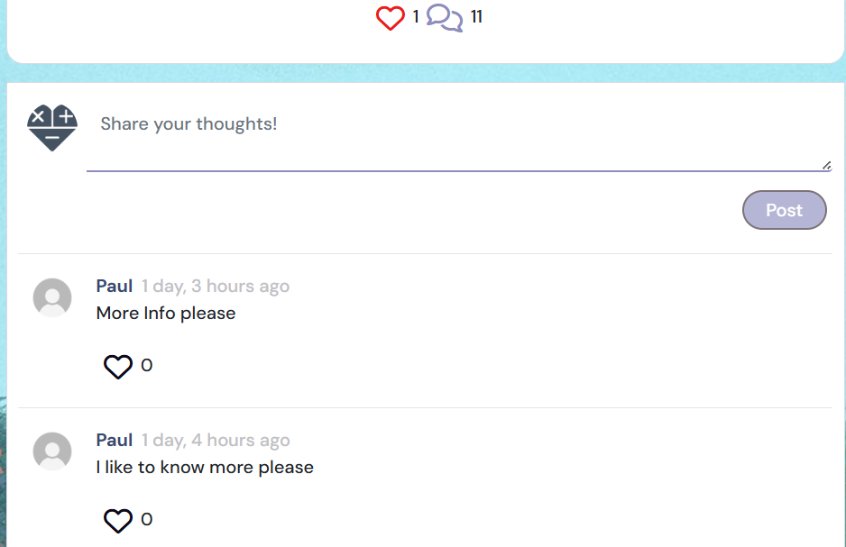
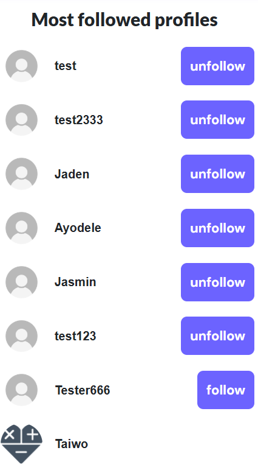

# **Art Connect**
Art Connect is an interactive art blogging platform that allows users to share their artwork, engage with posts through likes and comments, and explore different categories. The inspiration for creating this blog came from my spouse, who is an artist and has always wanted a space to showcase his work and connect with other creatives. 
While this website could have real-world applications, it was specifically developed as part of Portfolio Project 5 (Advanced Front End) for the Diploma in Full Stack Software Development with Code Institute.
 Although it’s not a fully realized blog, the process has given me valuable insights into what I can build for my spouse in the future.
Take a look at the live website [here](https://arts-8a67ad6d4259.herokuapp.com/)

# [Table of Contents](#table-of-contents)
- [**Project**](#project)
  - [Objective](#objective)
  - [Site User's Goal](#site-users-goal)
  - [Site Owner's Goal](#site-owners-goal)
  - [Project Management](#project-management)
- [**User Experience (UX)**](#user-experience-ux)
  - [User Stories](#user-stories)
  - [Site Structure](#site-structure)
  - [Design Choices](#design-choices)
- [**Existing Features**](#existing-features)
  - [Authentication](#authentication)
  - [Homepage](#homepage)
  - [Timeline](#feed)
  - [Liked](#liked)
  - [Profile Page](#profile-page)
- [**Future Implementations**](#future-implementations)
- [**Technologies Used**](#technologies-used)
  - [Languages](#languages)
  - [Frameworks & Software](#frameworks--software)
  - [Libraries](#libraries)
- [Testing](#testing)
- [Deployment](#deployment)
- [Credits](#credits)
- [Acknowledgements](#acknowledgements)

# **Project**

## Objective

The objective of this project is to create a web apllication where artist can come together to showcase their works of art, share ideas and organize art exhibitions.

## Site User's Goal

The goal of the Art Blog site is to create a vibrant online community for artists and art enthusiasts. Users can:

#### 🎨 Share Artwork – Upload and showcase their art through posts with images and descriptions. 
#### ❤️ Engage with Others – Like, comment on, and follow other artists to build a creative network.
#### 📸 Browse Art Galleries – Explore different categories of artwork in an organized gallery view.
#### 🔔 Stay Updated – Follow favorite artists to receive updates on their latest posts.
#### ✍️ Discuss & Collaborate – Engage in meaningful discussions about art, techniques, and inspiration. 
#### 📅 Create & Share Events – Users can post details about upcoming art events, workshops, exhibitions, or meetups.
#### 💬 Discuss & Network – Each event could have a comment section for discussions, collaborations, or carpooling arrangements

[Back to top](<#table-of-contents>)

## Site Owner's Goal

#### 🎨 Fostering an Art Community – Create a welcoming space where artists and art lovers can share, discuss, and appreciate art.
#### 📈 Growing User Engagement – Encourage users to post, comment, like, and interact with each other’s work.
#### 🔗 Networking & Collaboration – Help artists connect for collaborations, commissions, and exhibitions.
#### 📅 Promoting Art Events – Provide a platform for sharing art-related events, workshops, and gallery openings.
#### 💰 Monetization & Sustainability – Explore options like ads, premium memberships, or featured posts to sustain the platform.
#### 🏆 Showcasing Talent – Highlight emerging artists and their work through featured posts or interviews.

[Back to top](<#table-of-contents>)

# **User Experience (UX)**

### ✅ Easy Navigation – Users should be able to browse posts, profiles, and events seamlessly with a clean and intuitive UI.

#### 👤 Personalized Profiles – Users can customize their profiles, showcase their portfolio, and engage with others.

#### 🖼 Smooth Image Upload & Display – High-quality image uploads with a visually appealing view for artwork. User can edit and delete their posts

#### 🔍 Effective Search & Filtering – Users should be able to find specific artworks, artists, or events easily.

#### ❤️ Interactive Features – Likes, comments, and follows to encourage engagement and community-building.

## User Stories
Like with the backend, I used the Kanban project board in GitHub to help guide me through the user stories for the frontend application. creating this API. I used Agile principles again to create 5 EPICs and their subsequent user stories, where each user story belongs to one EPIC. Since most user stories dealing with my 7 separate apps in this project were discussed in the backend README documentation, I'll cover new EPICs here along with their user stories.

### NavBar
As the developer I can create a functional navigation bar at the top of my page so that users can easily look at different pages of the site.

#### User Stories
- As a user I can click each navbar icon so that I am redirected to different pages.
- As a user I can upload a profile picture so that other users can see who my account belongs to.

### Homepage
As the developer I can create a homepage where users can log in / register and see site information so that they know of events occurring.

#### User Stories
- As a user I can create an account so that I can create and view posts and see other users' profiles.
- As a user I can log into my account so that I can interact fully with the website.
- As a logged in user I can see a list of posts so that I can like and share my comments on.
- As a logged in user I can use the search bar so that I can search for posts or other users by keyword.
- As a logged in user I can view the 'popular profiles' section so that I can see profiles of other users and choose to follow them.

### Profile
As the developer I can create a Profile section so that users can update personal information and images.

#### User Stories
- As a user I can upload a picture so that other users can see who I am via my profile.
- As a user I can view others' profiles so that I can see their posts and profile details.
- As a user I can edit my own profile so that the information always remains updated and correct.
- As a user I can change my username and password so that these credentials are updated in case of a security issue.

### Comments
As the developer I can create a Comments section so that users can comment on posts and interact with others on the site

#### User Stories
- As a user I can comment on a post so that others will know my opinion.
- As a user I can view other comments on a post or event to know what their opinion is on the post.
- As a user I can edit my own comments so that information is corrected.
- As a user I can delete my own comments so that any erroneous information from a comment is not on the site.
- As a user I can like and unlike comments of other users.

### Following
As the developer I can create a followers section so that registered, logged in users can follow and unfollow other users.

#### User Stories
- As a user I can follow another registered user so that I can view their profile on my feed page.
- As a user I can unfollow another registered user so that their profile information will no longer be visible on my feed page.
- As the developer I can create follow / unfollow buttons so that registered, logged in users can follow and unfollow other users.

[Back to top](<#table-of-contents>)

## Site Structure

 The Art connect blog is interactive, both for non registered, non logged-in users and for users signed into their account. Depending on login status different pages are available for the user. When the user is logged out the pages: Home, and Sign In or Up are available from the Navigation Bar menu. When the user is logged in, Home, Timeline,Signout and Profile Page also become available.

 
